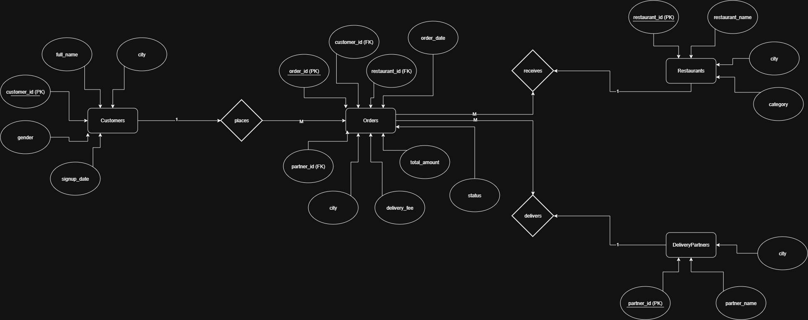

# FoodDash Database Project

A Microsoft SQL Server database project that models a food-delivery platform. It covers customers, restaurants, delivery partners, orders, constraints, relationships, and analytical SQL queries.

## Run

Open `FoodDash.sql` in SQL Server Management Studio and execute it section by section. The script creates the `FoodDash` database, defines its tables and relationships, and includes the project queries.

## Main Entities

- Customers
- Restaurants
- Delivery partners
- Orders
